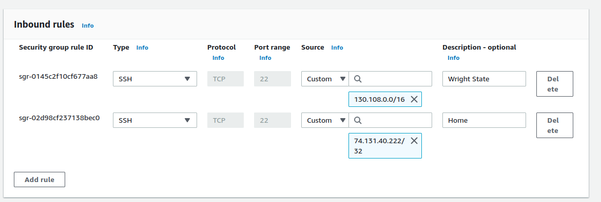

## Part 1 - Build a VPC
1. Create a VPC

2. Create a Subnet

3. Create an internet gateway

4. Create a route table

5. Create a security group

## Part 2 - EC2 Instances
1. Create a new instance

I chose Ubuntu as my AMI. Default username chosen.

2. Attach the instance to the VPC

I attached it by changing the network settings in the EC2 instance creator

3. Determine whether a Public IPv4 address will be auto-assigned

I did choose to enable this setting as this is a throw-away instance. Enabling this means that this instance is automatticaly given a random IP address (that doesn't count as elastic according to what I'm reading). This IP is not consistent so if programs or computers want to connect to this instace they'll have to be given the IP it's using. Again, since this is a throw-away instance I'm going to delete after this project this isn't a big deal.

4. Attach a volume to your instance

I added a volume through the EC2 creation menu:

5. Tag your instance

I tagged the instance by using the "Name and Tags" setting in EC2:

6. Associate your security group

Once again, I did this through the EC2 settings:

7. Reserve an Elastic IP address

I reserved this by navigating to EC2 > Elastic IP addresses > Allocate Elastic IP address menu:

8. Instance Details Screenshot

9. ssh into the instance and change the hostname

I was able to ssh into my instance by creating a keypair and saving the private key.
After doing that, this command:
> ssh -i "instancekey.pem" ubuntu@44.210.29.98

Got me into the instance. From there I created a new 'hostname.old' file and stored the old hostname into it. After that I used this command to change the hostname

> sudo hostname Heinlein-Ubuntu

10. Screenshot of ssh connection & hostname

