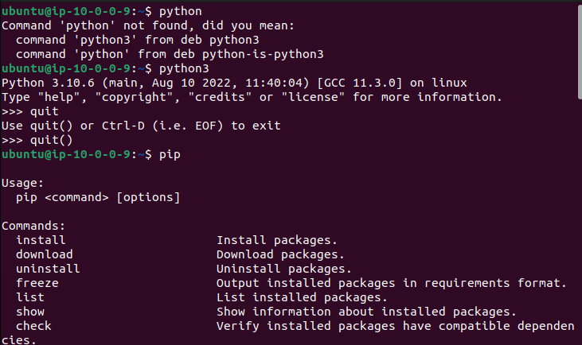

## Notes on Cloud Formation Template
### Ethan Heinlein | CEG3120
Ami Replaced:
ami-07d0cf3af28718ef8 -> ami-08c40ec9ead489470 (more updated Ubuntu according to AWS's AMI menu).

The Instance is using the private ip:
> 10.0.0.9
Within the specified subnet.

The following commands were added to the *apt-get install -y* block:
> python3 \
> python3-pip \

And this was added to change the hostname:
> hostname Heinlein-Ubuntu \

Proof of SSH and python/pip install success:

