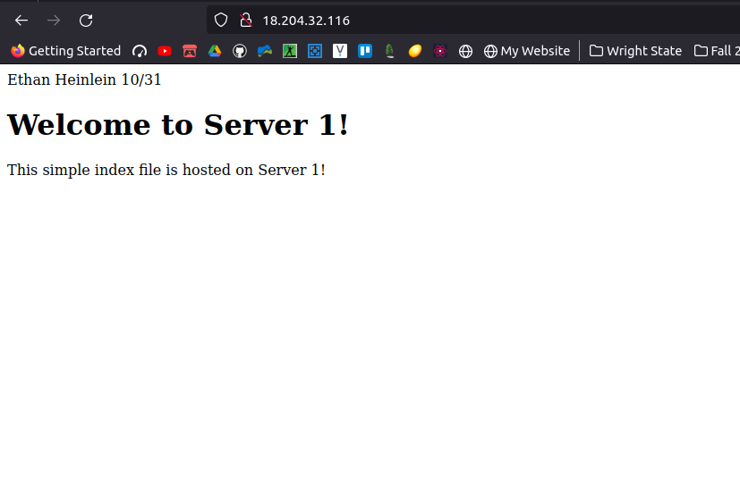
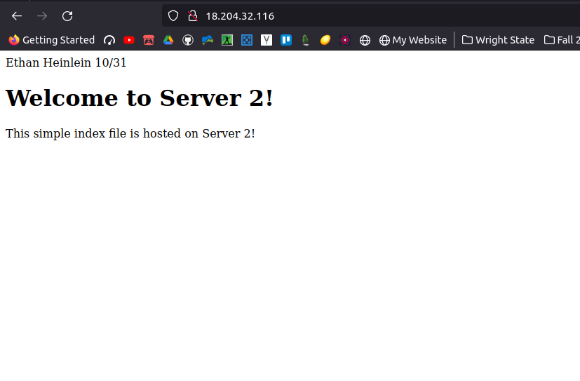

## Part 2 Notes:
1. I modified the `/etc/hosts` file on each system to contain the IP and hostname of the other systems (proxy seen below):
```
10.0.1.10 webserv1
10.0.1.20 webserv2
```
---
2. To SSH into between the systems, we first need to connect to the proxy from our machine, as the webservers dont have public IPs to connect to (it would defeat the whole point of setting up the proxy):
```
ssh -i [KEYNAME].pem ubuntu@[Proxy EIP]
```
After connecting to the proxy, we need to transfer the ssh key over to the proxy and servers using sftp:
```
sftp -i [KEYNAME].pem webserv1
sftp>> put [KEYNAME].pem
```
Then we can finally ssh into the systems. Thanks to the `/etc/hosts` file we can use the alias we set instead of the private ip (as we correlated the two earlier)
```
ssh -i [KEYNAME].pem webserv1
ssh -i [KEYNAME].pem webserv2
```
---
3. HAProxy Config
The config file is available at `/etc/haproxy/haproxy.cfg`
- This `frontend` section was added:
```
frontend myfrontend
        bind 10.0.0.10:80
        default_backend web_servers
```

- This `backend` section was added:
```
backend web_servers
        balance roundrobin
        server webserv1 10.0.1.10:80
        server server2 10.0.1.20:80
```

> NOTE: 'roundrobin' is the default but I wanted to set it to show I know the difference.

- To restart the haproxy service after making changes, run this command:
```
sudo systemctl restart haproxy
```

Resources used:
- [HA Proxy](https://www.haproxy.com/blog/the-four-essential-sections-of-an-haproxy-configuration/)
---
4. Setting up the webservers (these steps are repeated for both servers)
- Access (and change) the default web page with:
```
sudo vim /var/www/html/index.html
```
- Change the contents of the page to match index.srv1.html or index.srv2.html respectively.
- There is already a perfectly running configuration for this default page, so there is no need to mess with the apache config files, just changing the default index.html page should be enough for this project's purposes.
- Use this command to restart the apache server after making changes
```
sudo systemctl restart apache2
```

Resources used:
- [How to install apache on Ubuntu](https://www.digitalocean.com/community/tutorials/how-to-install-the-apache-web-server-on-ubuntu-20-04)

> NOTE for dev: reach server with http://(EIP):80/
---
5. Screenshots

Server 1 content:


Server 2 content:
